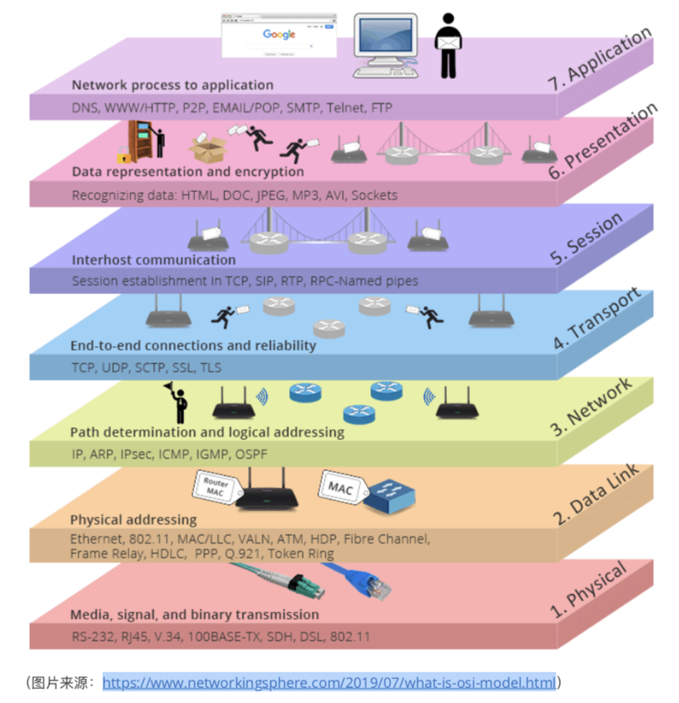
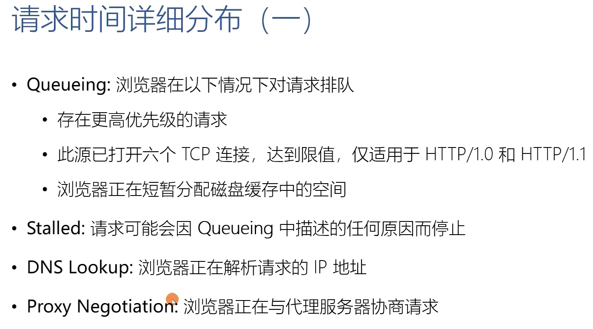
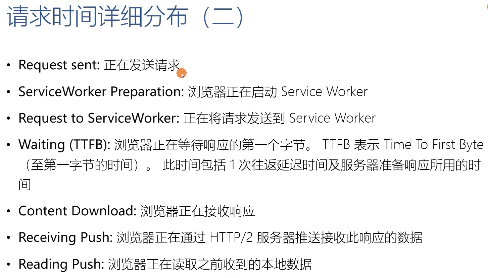

# 使用 `telnet` 抓包
  在控制台输入
  ```shell
    telnet 39.106.67.129 8080
    GET /zentao/js/jquery/syntaxhighlighter/styles/shThemeDefault.css?v=11.6.3 HTTP/1.1
    Host: 39.106.67.129
  ```

  返回的响应是基于 `ABNF` 描述的 `HTTP` 协议格式

  ```shell
  ✘ wujiang@wujiangdeMacBook-Pro  /workSpace/svn  telnet 39.106.67.129 8080
  Trying 39.106.67.129...
  Connected to 39.106.67.129.
  Escape character is '^]'.
  GET /zentao/js/jquery/syntaxhighlighter/styles/shThemeDefault.css?v=11.6.3 HTTP/1.1
  Host: 39.106.67.129

  HTTP/1.1 200 OK
  Date: Fri, 30 Jul 2021 05:10:04 GMT
  Server: Apache
  Last-Modified: Tue, 24 Sep 2019 02:45:50 GMT
  Accept-Ranges: bytes
  Content-Length: 2877
  Vary: Accept-Encoding
  Cache-Control: max-age=604800
  Expires: Fri, 06 Aug 2021 05:10:04 GMT
  Content-Type: text/css

  /**
  * SyntaxHighlighter
  * http://alexgorbatchev.com/SyntaxHighlighter
  *
  * SyntaxHighlighter is donationware. If you are using it, please donate.
  * http://alexgorbatchev.com/SyntaxHighlighter/donate.html
  *
  * @version
  * 3.0.83 (July 02 2010)
  *
  * @copyright
  * Copyright (C) 2004-2010 Alex Gorbatchev.
  *
  * @license
  * Dual licensed under the MIT and GPL licenses.
  */
  .syntaxhighlighter {
    background-color: white !important;
  }
  .syntaxhighlighter .line.alt1 {
    background-color: white !important;
  }
  .syntaxhighlighter .line.alt2 {
    background-color: white !important;
  }
  .syntaxhighlighter .line.highlighted.alt1, .syntaxhighlighter .line.highlighted.alt2 {
    background-color: #e0e0e0 !important;
  }
  .syntaxhighlighter .line.highlighted.number {
    color: black !important;
  }
  .syntaxhighlighter table caption {
    color: black !important;
  }
  .syntaxhighlighter .gutter {
    color: #afafaf !important;
  }
  .syntaxhighlighter .gutter .line {
    border-right: 3px solid #6ce26c !important;
  }
  .syntaxhighlighter .gutter .line.highlighted {
    background-color: #6ce26c !important;
    color: white !important;
  }
  .syntaxhighlighter.printing .line .content {
    border: none !important;
  }
  .syntaxhighlighter.collapsed {
    overflow: visible !important;
  }
  .syntaxhighlighter.collapsed .toolbar {
    color: blue !important;
    background: white !important;
    border: 1px solid #6ce26c !important;
  }
  .syntaxhighlighter.collapsed .toolbar a {
    color: blue !important;
  }
  .syntaxhighlighter.collapsed .toolbar a:hover {
    color: red !important;
  }
  .syntaxhighlighter .toolbar {
    color: white !important;
    background: #6ce26c !important;
    border: none !important;
  }
  .syntaxhighlighter .toolbar a {
    color: white !important;
  }
  .syntaxhighlighter .toolbar a:hover {
    color: black !important;
  }
  .syntaxhighlighter .plain, .syntaxhighlighter .plain a {
    color: black !important;
  }
  .syntaxhighlighter .comments, .syntaxhighlighter .comments a {
    color: #008200 !important;
  }
  .syntaxhighlighter .string, .syntaxhighlighter .string a {
    color: blue !important;
  }
  .syntaxhighlighter .keyword {
    color: #006699 !important;
  }
  .syntaxhighlighter .preprocessor {
    color: gray !important;
  }
  .syntaxhighlighter .variable {
    color: #aa7700 !important;
  }
  .syntaxhighlighter .value {
    color: #009900 !important;
  }
  .syntaxhighlighter .functions {
    color: #ff1493 !important;
  }
  .syntaxhighlighter .constants {
    color: #0066cc !important;
  }
  .syntaxhighlighter .script {
    font-weight: bold !important;
    color: #006699 !important;
    background-color: none !important;
  }
  .syntaxhighlighter .color1, .syntaxhighlighter .color1 a {
    color: gray !important;
  }
  .syntaxhighlighter .color2, .syntaxhighlighter .color2 a {
    color: #ff1493 !important;
  }
  .syntaxhighlighter .color3, .syntaxhighlighter .color3 a {
    color: red !important;
  }

  .syntaxhighlighter .keyword {
    font-weight: bold !important;
  }
  Connection closed by foreign host.
  ```


# OSI 概览模型
  - 应用层：HTTP FTP Telnet SMTP
  - 表示层：TLS SSL
  - 会话层
  - 传输层：TCP UTP
  - 网络层：IP
  - 数据链路层：路由器
  - 物理层：网线

# 浏览器加载时间
  - 解析 HTML 结构
  - 加载外部脚本和样式表文件
  - 解析并执行脚本代码。// 部分脚本会阻塞页面加载
  - DOM 树构建完成。// DOMContentLoaded 事件
  - 加载图片等外部文件
  - 页面加载完成。// load 事件

# 请求时间详细分布
  
  
