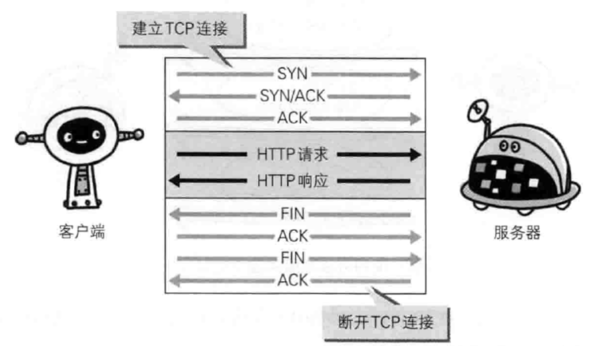

# 1、登录怎么实现的？
  登录是客户端输入用户名和密码发送请求到服务端，服务端通过 `Set-Cookie` 将 `cookie` 添加到响应头。
  客户端获取到响应头，存储该 `cookie`。
  客户端每一次请求都会将之前保存的 `Cookie` 信息通过 `Cookie` 请求头发送到到服务端，服务端校验 `cookie` 验证用户是否登录。

  `cookie` 的缺点：
  1. 明文传递，不安全
  2. 有大小限制，最大 `4kb`
  3. 每个域名对于 `cookie` 有数量限制，最多 `20` 个
  4. 可能被用户禁用

  `cookie` 的安全隐患
  1. 会话固定攻击（Session fixation attacks）
    客户端本地存在未过期的 `Cookie`，登录时将该 `Cookie` 发送至服务端，服务端未更新 `Cookie`，直接将返回登录时客户端传递的 `Cookie`。
    攻击者可以利用这个漏洞发起会话劫持。
    措施：用户登录后更新 `Cookie`
    **博客** https://www.cnblogs.com/uestc2007/p/10944391.html
  2. 跨站脚本攻击（Cross Site Scripting）
     攻击者在 `Web` 页面插入恶意 `Script` 代码，窃取用户 `Cookie`，劫持流量等
     措施：在 `Cookie` 中添加 `HttpOnly` 标识
  3. 中间人攻击（Man-in-the-middle attack）
     攻击者拦截客户端和服务端之间的通讯。
     措施：在 `Cookie` 中添加 `Secure` 标识
  4. 跨站请求伪造（Cross-site request forgery）
     攻击者冒充用户，向服务器发送恶意请求
     措施：在 `Cookie` 中将 `SameSite` 为 `Strict`，只能在相同域发送 `Cookie`
          在请求地址添加 `token` 验证。 https://blog.csdn.net/stpeace/article/details/53512283
  5. 会话劫持（Session hijacking）
     攻击者窃取 `Cookie`
     措施：更改默认 `sessionid` 的名称，设置 `HttpOnly`

  `Cookie` 的安全措施
  1. 限制访问 `Cookie`
     1. `Secure` 和 `HttpOnly` 都可以确保 `Cookie` 被安全发送，且不会被意外参与者或脚本访问
     2. 开启 `Secure` 标识可以预防 `中间人攻击`，`Cookie` 在https的加密通信中传输以防截获
        https://developer.mozilla.org/zh-CN/docs/Glossary/MitM
        https://blog.csdn.net/huangliuyu00/article/details/80189069

# 2、Cookie和Session关系
  1. 都是为了保存客户端和服务器状态而诞生的
  2. `Cookie` 保存在客户端，明文传递，易伪造，不安全
  3. `Session` 保存在服务器端，消耗服务器资源
  4. `Session` 可以通过 `Cookie` 和 通过 `URL` 重写

# 3、[单点登录实现](https://juejin.cn/post/6844904038555729927#heading-0)
  1. 一个子系统登录通过认证中心登录后，即可登录其他子系统
  2. 在同域名下，`Cookie` 设置 `domain` 为父域名，那么子系统中发送请求会携带父域名的 `Cookie`，校验是否登录即可

# 4、扫码登录实现
  https://zhuanlan.zhihu.com/p/108976341
  https://www.cnblogs.com/54chensongxia/p/12530268.html
  1. 客户端请求二维码接口，服务端生成 `uuid`，设置过期时间，存入 `Redis`
  2. 客户端拿到二维码信息，生成二维码，以 `uuid` 轮询调用接口判断用户是否登录，直到二维码失效

# 5、TCP/IP 四层网络模型
  `TCP/IP` 协议族有四层网络模式，从上到下分别是：
  - 应用层
    - `HTTP` 超文本传输协议
    - `FTP` 文件传输协议
    - `DNS` 域名系统
  - 传输层
    - `TCP` 传输控制协议
    - `UDP` 用户数据报协议
  - 网络层
    - `IP` 网际协议
  - 数据链路层
    - 处理连接网络硬件，网卡、光纤等

# 6、TCP 三次握手
  1. 发送端发送带有 `SYN` 标志的数据包到接收端
  2. 接收端收到数据包后，发送带有 `SYN/ACK` 标志的数据包
  3. 发送端收到数据包后，发送带有 `ACK` 标志的数据包，表示“握手”结束
  三次握手能确认数据是否送达，保证了数据传输的可靠性。

# 7、TCP 四次挥手
  
  1. 发送端发送带有 `FIN` 标志的数据包到接收端
  2. 接收端收到数据包后，发送带有 `ACK` 标志的数据包
  3. 接收端处理完毕后，发送 `FIN` 标志数据包到发送端
  4. 发送端收到数据包后，发送带有 `ACK` 标志的数据包

# 8、每一次 `HTTP1.0` 请求过程
  1. 建立 `TCP` 连接
  2. `HTTP` 请求/响应
  3. 断开 `TCP` 连接

# 9、持久连接
  在 `HTTP1.0` 中，由于每一次 `HTTP1.0` 请求都会重复第 8 题的步骤。
  一个页面有很多图片需要加载，就需要建立请求、断开请求，不仅增加了客户端请求时间，
  且增加了服务器端通信的开销。
  故 `HTTP1.1` 新增了 `持久连接`，即 `HTTP keep-alive`，第一次建立 `TCP` 连接后，
  进行多次 `HTTP` 请求/响应，最后再断开 `TCP` 连接。
  优点：1、减少 `TCP` 连接重复建立、断开的开销
       2、`HTTP` 请求以管线化发送，无需等待前一个请求的响应，即可发送下一个请求
       3、减轻了服务器端负载
       4、Web页面能更快显示
  `HTTP1.1` 的连接默认是 `持久连接`
  `HTTP1.0` 的连接默认是前一个请求结束后，才能发送下一个请求

# 10、`HTTP` 的内容编码
  1. 服务器端在发送内容实体时，会压缩实体信息，客户端接收并负责解码。
  2. 常见内容编码有 `gzip`、`compress` 等
  3. 服务器端在发送大容量数据时，会将数据分割成很多块，客户端逐步显示页面。

# 11、HTTP 协议特点
  1. 无状态的协议，不保留之前一切的请求或响应报文
  2. 快速处理大量事务
  3. 减少服务器端内存消耗

# 12、 HTTP 的缺点
  1. 通信使用明文，可能被窃听
  2. 未验证通信方身份，可能是伪装
  3. 无法证明报文的完整性，可能被篡改
  4. 并发连接数有限
  5. 同一连接只能完成一次 HTTP 事物（请求/响应）才能开始下一个事物
  6. 每一次 HTTP 事物都会重复传输体积巨大的 HTTP 头部
  7. HTTP/1.X版本是采用文本格式，首部未压缩
  8. 客户端主动发起请求，无法提供服务器端推送

# 13、HTTP 加密方式
  `HTTP` 协议没有加密方式，故需要对 `HTTP` 加密防止被窃听。
  - `通信的加密`
    - 使用 `SSL` 加密通信线路
  - `内容的加密`
    - 客户端和服务端使用相同的加密、解密方式，但依然存在被篡改的风险

# 14、`HTTP` 状态码
  |      | 类别   | 原因短语 |
  | ---- | ----  |----  |
  | 1XX  | Informationnal（信息性状态码） |请求正在处理 |
  | 2XX  | Sucess（成功状态码） |请求正常处理完毕 |
  | 3XX  | Redirection（重定向状态码） |需要进行附加操作以处理请求 |
  | 4XX  | Client Error（客户端错误状态码） | 服务器无法处理请求 |
  | 5XX  | Server Error（服务器端错误状态码） |服务器处理请求出错 |

  - 2XX 成功
    - 200 OK 请求处理成功
    - 204 No Content 请求处理成功，但无资源返回
    - 206 Partial Content 客户端进行范围请求，服务器端成功响应。响应报文 `Content-Range` 指定范围的实体内容。

  - 3XX 重定向 https://blog.csdn.net/grandPang/article/details/47448395
    - 301 Moved Permanently 永久重定向
    - 302 Found 临时重定向
    - 303 See Other
    - 304 Not Modified
    - 307 Temporary Redirect 临时重定向

  - 4XX 客户端错误
    - 400 Bad Request 请求报文存在语法错误
    - 401 Unauthorized 请求需通过 `HTTP` 认证
    - 403 Forbidden 请求资源被服务器端拒绝。
    - 404 Not Found 服务器上没有找到请求资源

  - 5XX 服务器错误
    - 500 Internal Server Error 服务器端执行请求出现错误
    - 503 Server Unavailable 服务器处于超负载或停机维护

# 15、HTTPS
  - `HTTPS` 就是身披 `SSL` 的 `HTTP`
  - `HTTP` 先和 `SSL` 通信，`SSL` 再和 `TCP` 通信
  - `HTTP` 采用 `SSL` 后就拥有了 `HTTPS` 的加密、证书和完整性保护（防止传输内容被篡改）了。

# 16、HTTPS 缺点
  - `HTTPS` 比 `HTTP` 慢 2 ~ 100 倍
  - `HTTPS` 需要对客户端和服务器端进行加密、解密处理，所以会消耗更多的硬件资源

# 17、用户输入url到页面展示的过程
  - 浏览器地址栏输入 url 地址时，还未完全输入，浏览器引擎查找历史数据存储中访问过的 url，显示出已经访问过的完整 url 地址。
  - 浏览器获取 url 敲下回车键后，如果是ip地址则省略 `DNS` 解析，否则浏览器引擎调用渲染引擎。
  - `DNS` 解析（根据域名查询 `DNS`）
    - 浏览器从 自身缓存 -> 操作系统（host文件）-> 本地域名服务器 -> 根域名服务器 查找
    - 然后 根域名服务器 -> 主域名服务器 -> 本地域名服务器 -> 操作系统，缓存域名对应的ip
    - 浏览器发起 `HTTP` 请求，请求到达 `传输层`，建立 `TCP` 连接，分割数据包，然后请求大道 `网络层`，最后到达 `数据链路层`。
    - 由 `数据链路层` 层层往上到达服务器的 `应用层`，服务器查找资源并响应报文。
  - 建立 `TCP` 连接
    - 三次握手建立 `TCP` 连接（`HTTPS` 还需要完成 `TLS/SSL` 握手）
  - 发起 `HTTP` 请求
    - 构造 `HTTP` 请求，填充上下文至 `HTTP` 头部，发起 `HTTP` 请求。
  - JS 解释器（v8 或 JavaScriptCore）
    - 解析执行 JavaScript。
  - 渲染引擎接收资源并渲染页面。
    - 浏览器通过 `HTML Parse` 将 `HTML` 解析成 `DOM Tree`
    - 将 `CSS` 解析成 `CSS OM Tree`
    - 通过 `CSS OM Tree` 和 `DOM Tree` 构造 `Render Tree`
    - Layout: 通过 `Render Tree` 计算所有节点在屏幕的位置
    - Paint: 遍历 `Render Tree`，绘制节点。
  - 渲染引擎遇到 `<script>` 标签时，暂停解析，将控制权交给 JS 解释器。JS 解释器解析完成后，将控制权交给渲染引擎。

