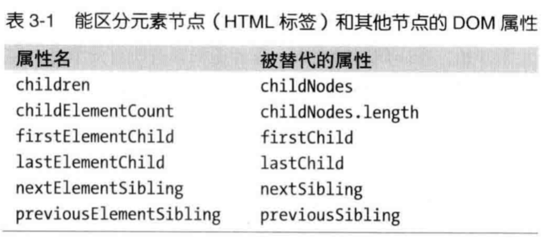

# 前言
  本书作者 `Nicholas.C.Zakas`，出版于2010年，同时也是是第3版JavaScript高级程序设计的作者。
  他的网站域名 `https://www.nczonline.net/`，通过 `301` 永久重定向到 `https://humanwhocodes.com/`

# 1、加载和执行
  ## 1.1 脚本位置
    浏览器遇到<script>标签，会执行js代码，遇到有src属性的<script>会加载并执行js代码。脚本会阻塞页面其他资源的下载，此时页面渲染是完全被阻塞的。
  **建议：**
  - 将脚本放在 `<body>` 标签底部。
  - 合并脚本。
  - 无阻塞脚本：页面加载完后再加载脚本。即 `window.load` 事件出发后加载脚本。
  - 延迟脚本：如果脚本不会改变文档内容，可添加 `defer` 属性后将延迟脚本执行，直到页面加载完毕。加载过程中不会产生阻塞
    - `async` 和 `defer` 区别
    - 都可以并行加载脚本，在加载过程中不会产生阻塞，即不会阻塞浏览器其他进程。`async` 加载完成后，自动执行脚本，`defer` 等待页面加载完毕再执行。
  - 动态脚本。直接创建 `script` 标签，设置src，添加到 `head`，监听 `load` 事件。加载过程中不会产生阻塞
  - xhr脚本注入。使用 `xhr` 注入脚本，只能在同源中使用，`cdn` 不可用。加载过程中不会产生阻塞

  - css文件是并行下载，不会阻塞页面的其他进程。
# 2、数据存储
  ## 2.1 作用域链和标识符解析
  **作用域：**
  每一个 `JavaScript` 函数都是 `Function` 对象的实例，都有一个内部属性 `[[Scope]]`。
  `[[Scope]]` 是函数的作用域链，是作用域对象的集合。
  每次调用函数时都会创建一个函数执行环境，用于解析标识符，函数执行完毕，执行环境被销毁。
  执行环境初始化为函数的 `[[Scope]]` 内部对象，包含 `活动对象`（局部变量、参数、this、arguments），和 `全局对象`（window、document），其中当前函数作用域的活动对象
  在作用域链的最前端，其次才是全局对象。

  **执行环境解析标识符**
  函数执行过程中，每遇到一个变量，都会从执行环境的作用域链的头部（当前运行函数的活动对象）开始解析，如果找到，就使用这个标识符对象的变量。如果没有找到，则继续搜作用域链的下一个对象，直到找到标识符为止。

  **对于函数的执行环境作用域链中，一个标识符所在位置越深，读写速度越慢**

  **函数执行环境作用域链的最末端就是全局对象**

  **改变作用域链**
  try-catch中的catch子句和with语句都能改变作用域链。

  ## 2.2 闭包、作用域和内存
  **闭包：**
  闭包允许函数访问局部作用域之外的数据。
  闭包代码执行时，创建一个执行环境，其作用域链和 `[[Scope]]` 属性中包含了外部函数的作用域链对象的引用。
  由于外部函数的 `活动对象`（局部变量、参数、this、arguments）的引用依然在闭包的 `[[Scope]]` 属性中，故无法随着其执行环境一起被销毁。

  使用闭包会频繁的跨作用域获取标识符，都会带来性能上的损失，可以将跨作用变量（例如：全局变量）存储在局部作用域中，闭包中就能直接使用。

  ## 2.3 原型
  JavaScript 中的对象是基于原型的。所有的对象实例都可以共享原型对象，同时也共享了原型对象的成员。
  对象通过内部属性 `__proto_` 绑定原型，该原型就是 `Object` 实例。?
  对象拥有 `实例成员` 和 `原型成员`，`实例成员` 在对象实例中，`原型成员` 从对象原型中继承而来。
  ```js
  const obj = {
    title: '标题' // title是实例成员
  }
  obj.toString()  // toString方法原型成员，从对象原型中继承
  ```

  局部变量能替代属性避免多次查找带来的性能开销。

  **建议：**
  - 获取字面量、局部变量速度最快，获取数据元素和对象成员则慢一些
  - 局部变量位于作用域链起始位置，全局变量位于作用域链末端，变量在作用域链位置越深，获取变量的时间越长。
  - 避免使用with语句，会改变执行环境的作用域链。
  - 将对象成员、数组元素等保存在局部变量中，提高访问速度。

# 3、DOM编程
  ## 3.1 访问DOM
  用脚本操作 `DOM` 的代价很昂贵。
  访问 `DOM` 的次数越多，代码的运行速度越慢。
  `HTML` 集合一直保持着与文档的连接。
  遍历 `DOM` 的子元素时，将子元素的长度保存在局部变量中，因为元素集合的长度会随着子元素数量变化而变化，一旦在遍历时
  插入子元素到父元素中，那么这个遍历将无穷无尽，导致内存飙升！！！
  现代浏览器提供了一套专门读取子元素的 `API`，将只会读取元素，自动过滤文本、注释等 `node` 节点。
  

  使用 `Element` 的 API 操作速度更快。

  `querySelectorAll()`，返回一个 `NodeList`，并没有与文档连接，推荐使用。
  ## 3.2 重绘与重排
  `reflow`：重排，当页面元素位置、尺寸发生变化后，渲染引擎重新构造渲染树。
  `repaint`：重绘，重排后，渲染引擎重新绘制受到影响的部分到页面中。
  重排和重绘代价昂贵，尽量减少此类操作。

  **重排渲染队列**
  重排都会产生消耗，故浏览器将重排队列化，批量执行重排过程，然而，获取元素偏移量（offsets）、滚动位置（scroll values）和计算样式值（style value）都会立即执行渲染队列，触发重排，
  所以，尽量避免使用这一类的属性。

  **减小重排和重绘的方式**
  - 使用 `cssText` 合并修改元素样式属性。
  - 批量修改 `DOM`
  - 缓存布局信息
  - 元素脱离动画流

  **事件委托**
  事件的3个阶段：捕获-到达目标-冒泡。
  可以在父元素中绑定事件，判断目标，执行代码。

  **建议：**
  - 对于多次访问的DOM节点，使用局部变量存储
  - 减少重排和重绘
  - 使用事件委托
  - 使用速度更快的API，querySelectorAll和firstElementChild
  - 使用cssText批量修改样式
  - 使用文档片段批量操作元素。

# 4、算法和流程控制
  ## 4.1 循环性能
  for in 循环比for、while、do while更耗时，因为每一次循环都需要搜索实例成员或原型成员。
  for in 循环可以遍历自身的所有可枚举的属性和继承的所有可枚举属性。

  **建议：**
  - 避免使用for in 循环。
  - 缓存循环中数组长度，减少不必要的性能损失
  - 倒序循环比正序循环每一次循环都少一次比较。用倒序循环更优。
  - 基于函数的迭代（forEach）比基于循环的迭代慢
  - 当条件语句if-else大于2个时，用switch代替，switch性能更优
  - 当条件语句较多时，使用数组或者对象替代条件语句。速度：if-else < switch < 对象或数组
  - 递归会导致调用栈溢出错误，避免使用递归，改用迭代。

# 5、字符串和正则表达式

# 6、快速响应的用户界面
  ## 6.1 浏览器UI线程
  浏览器UI线程用于执行javascript和更新页面，执行js和更新页面是互斥的，只能同时执行一方。

  **建议：**
  - Web Wroker用于运行UI线程之外的代码。

# 7、Ajax
  查询数据使用 GET 请求，比 POST 请求更快。
  GET 请求，设置 HTTP 请求头 Expires，可以缓存请求内容。
  选择 JSON 数据格式，传输数据。

# 8、编程实践
  **建议：**
  - 避免使用 `eval()` 和 `Function()` 构造函数。特别是 `Funciton()` 函数以代码字符串的方式传入代码。就是为了避免双重求值。
  - 避免以代码字符串作为 `setTimeout()` 和 `setInterval()` 的第一个参数。就是为了避免双重求值。
  - 避免用 `Object` 、`Array` 构造函数创建对象或数组。应该用对象或数组的直接量表示，即 let obj = {};  let arr = []
  - JavaScript 位操作比数学操作速度更快。
  - 使用原生方法，例如：Math 数学运算和 DOM操作

# 9、构建并部署高性能JavaScript应用
  **建议：**
  - 合并JavaScript文件减少HTTP请求。
  - 压缩JavsScript
  - 服务器压缩 JavaScript 文件（Gzip编码）
  - 设置 Expires HTTP 响应头缓存 JavaScrit 文件，
  - 浏览器默认缓存静态文件，发布应用时，更新静态文件的文件名，让浏览器重新加载静态文件。
  - 使用内容分发网络（CDN），提升性能。

# 10、工具
